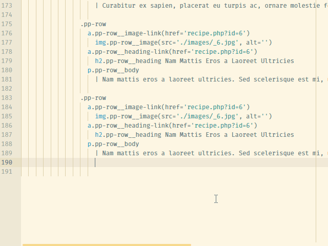

# Indent Tooltip Plugin for Atom

A useful helper for the indentation-sensitive languages, primarily designed for the Jade language.

This atom plugin adds a little tooltip that shows the parent block for current line. Works for the following languages:

- Jade
- Stylus
- CoffeeScript
- CSON

Use `Ctrl+Alt+T` hotkey to enable/disable the tooltip quickly.
